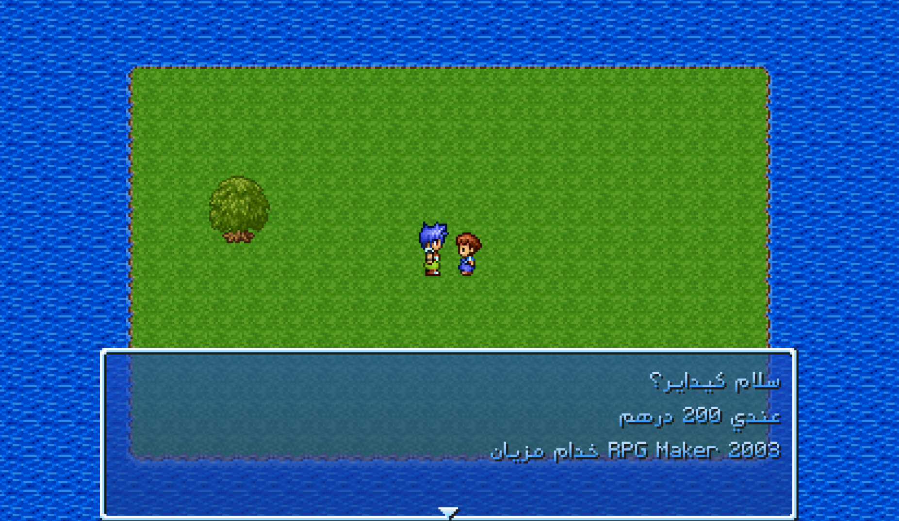

# EasyRPG-Arabic

EasyRPG-Arabic is a fork of EasyRPG Player focused on making it practical to
create RPG Maker 2000/2003 games in Arabic. It is especially aimed at people
who want to make small games quickly without getting overwhelmed by engine
setup or technical systems before they can start building the game itself.

It adds Arabic shaping with HarfBuzz, ICU Unicode BiDi, RTL menus and UI
layouts, right-aligned Arabic dialogue and choices, a bundled custom Arabic
pixel font with support for custom Arabic-capable fonts, and true RTL dialogue
typewriter rendering — Arabic dialogue is revealed from right to left. Mixed
Arabic, Latin text, and numbers are handled automatically.

The project also includes tools for managing Arabic game text using LcfTrans
and gettext PO files.

## Screenshots



## Download

Get EasyRPG-Arabic **v0.1** from the
[GitHub Releases page](https://github.com/DyarikoMan/EasyRPG-Arabic/releases/tag/v0.1-arabic).
This release is experimental and should be considered a pre-release.

- **EasyRPG-Arabic-Windows-x64.zip** — recommended download for most users.
- **Player.exe** — standalone Windows x64 executable.
- **Arabic-Translation-Toolkit.zip** — tools for managing Arabic text in RPG Maker projects.

## Quick start

1. Put `Player.exe` in the game folder beside `RPG_RT.exe`.
2. Put the Arabic PO files in `Language/ar/`. A typical folder looks like:

   ```text
   Language/
   └── ar/
       ├── Meta.ini
       ├── Font/
       │   └── Font.ttf
       ├── RPG_RT.ldb.po
       └── Map0001.po
   ```

3. Run `Player.exe` from the game folder. Arabic is selected automatically when
an Arabic language pack is available.

For optional widescreen rendering, run:

```powershell
Player.exe --game-resolution widescreen
```

## Arabic fonts

EasyRPG-Arabic includes a custom Arabic pixel font originally created by
**bou33ou** for a Minecraft Arabic localization/resource-pack project, then
reused and adapted for EasyRPG-Arabic. See the
[original Minecraft font project](https://modrinth.com/resourcepack/arabic-font).

The bundled font is `Language/ar/Font/Font.ttf`. You can replace it with another
TTF font that supports Arabic glyphs; the same font can be used for both RPG
Maker font slots. Arabic fonts can look very different at RPG Maker 2000/2003's
low resolution, so test your choice in-game.

## Tutorials

- [Create a new Arabic RPG Maker 2000/2003 game](docs/tutorials/create-arabic-game.md)
- [Arabic dialogue, choices, and RTL typewriter](docs/tutorials/arabic-dialogue-and-choices.md)

## Managing Arabic game text

See the [Arabic text toolkit guide](arabic/README.md) for details. Run the
updater from the repository or toolkit folder:

```powershell
.\arabic\tools\update-arabic.ps1 `
  -GamePath "C:\Games\MyRPG" `
  -LcfTransPath "C:\Tools\lcftrans.exe"
```

The toolkit creates or updates PO files for an RPG Maker project. It includes a
small starter set of system terms in Moroccan Darija; you can edit these
defaults for Modern Standard Arabic or another Arabic dialect.

## Status and limitations

EasyRPG-Arabic v0.1 has been tested with the stock RPG Maker 2000/2003 UI.
Custom windows, event-driven interfaces, and unusual layouts may still reveal
RTL or text rendering issues. Please report problems or suggestions on the
[GitHub issue tracker](https://github.com/DyarikoMan/EasyRPG-Arabic/issues).

## Upstream project

EasyRPG-Arabic is a fork focused on Arabic support; it is not the upstream
EasyRPG Player project and does not claim ownership of upstream code. EasyRPG
Player is developed by the EasyRPG Project:

- [EasyRPG Player source](https://github.com/EasyRPG/Player)
- [EasyRPG Project website](https://easyrpg.org/)

Upstream attribution is retained in this repository.

## Building and license

- Build instructions: [docs/BUILDING.md](docs/BUILDING.md)
- License: [COPYING](COPYING)
- Authors and contributors: [docs/AUTHORS.md](docs/AUTHORS.md)

EasyRPG Player and this fork are distributed under the GPLv3, according to the
repository license. See `COPYING` for the license text and retain upstream
copyright and attribution notices.
